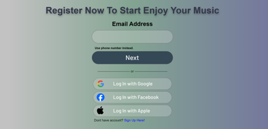

# Willify: Music Streaming Platform

Willify is a leading music streaming platform that provides a smooth and enjoyable music experience for users. The platform focuses on high-quality audio and a user-friendly interface.

## 🎶 Key Features

### Navigation Bar
The navigation bar is a key part of the website, allowing users to easily access different sections. It includes links to:
* Home
* Songs
* About Us
* Available Songs
* Register

### Home Page
The first page users see upon visiting the site. It features:
* The "Willify" logo.
* The "Best Selling Album of the Week."
* Recommended songs for users.

### Songs Page
This page is designed to help users discover music. It includes:
* A **search bar** to find specific songs or albums.
* A **"Top Albums"** section with a list of the latest albums.
* A **"Made For User"** section with personalized song mixes based on user preferences.

### About Us Page
This page provides background information about the Willify platform, including its origins and founders.

### Available Songs Page
This section showcases songs that are available to users for free. It also includes an invitation for users to register to unlock more music.

### User Authentication
The website offers a seamless authentication process:
* **Log In Page:** Allows existing users to log in with an email address, phone number, or social media accounts like Google, Facebook, and Apple.
* **Register Page:** A form for new users to create an account by providing their name, email, password, and date of birth.

### Song Detail Page
This page provides detailed information about a specific song, including the lyrics and a brief description of the artist.

### Footer
The footer, which is consistent across the site, provides access to important information and external links:
* Social media links.
* Links to the community, company, and useful resources.
* Information on premium subscription plans.
* Legal documents like the Terms of Service and Privacy Notice.

---
### 📱 Mobile Responsiveness
The website is designed to be fully responsive, with dedicated layouts for mobile devices to ensure a consistent experience across all screen sizes.

**Inspiration and References:**
The design and functionality of this website were inspired by music streaming applications like Spotify.
